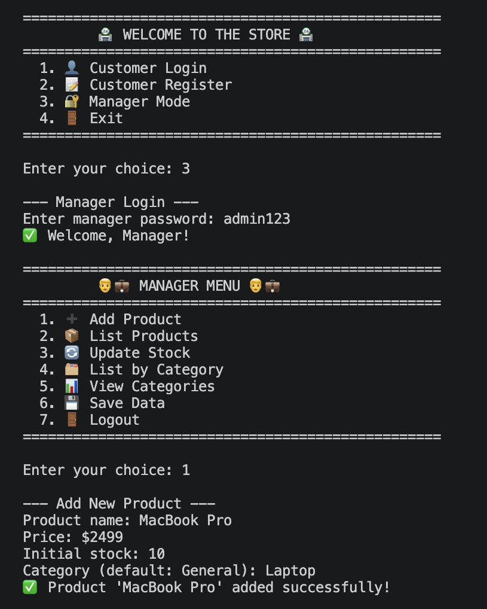
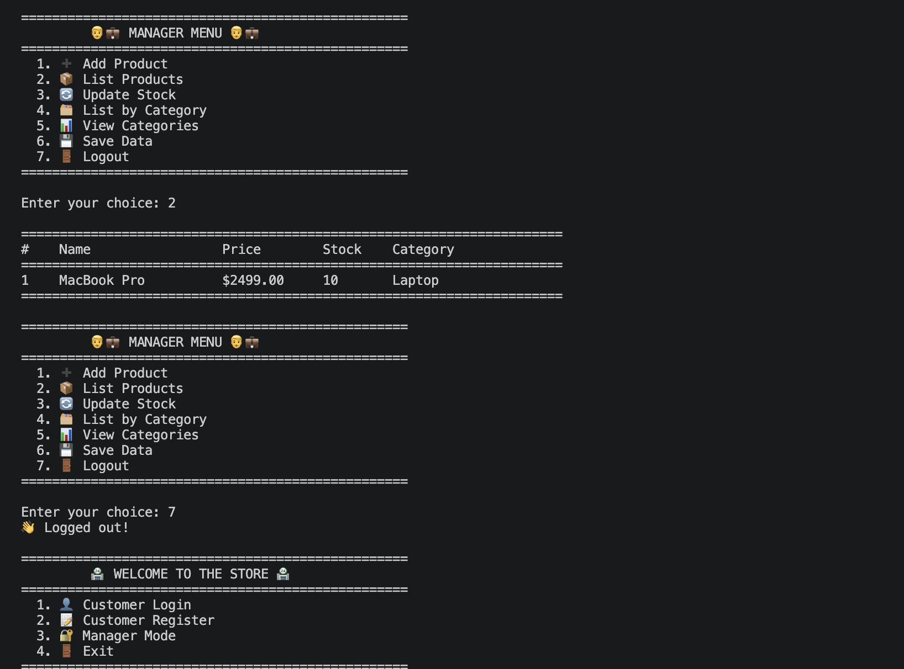
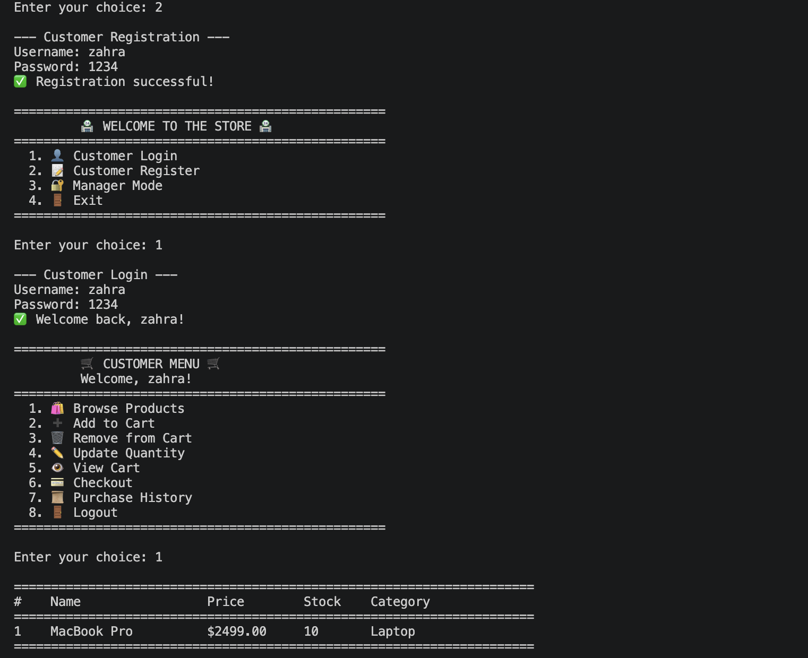
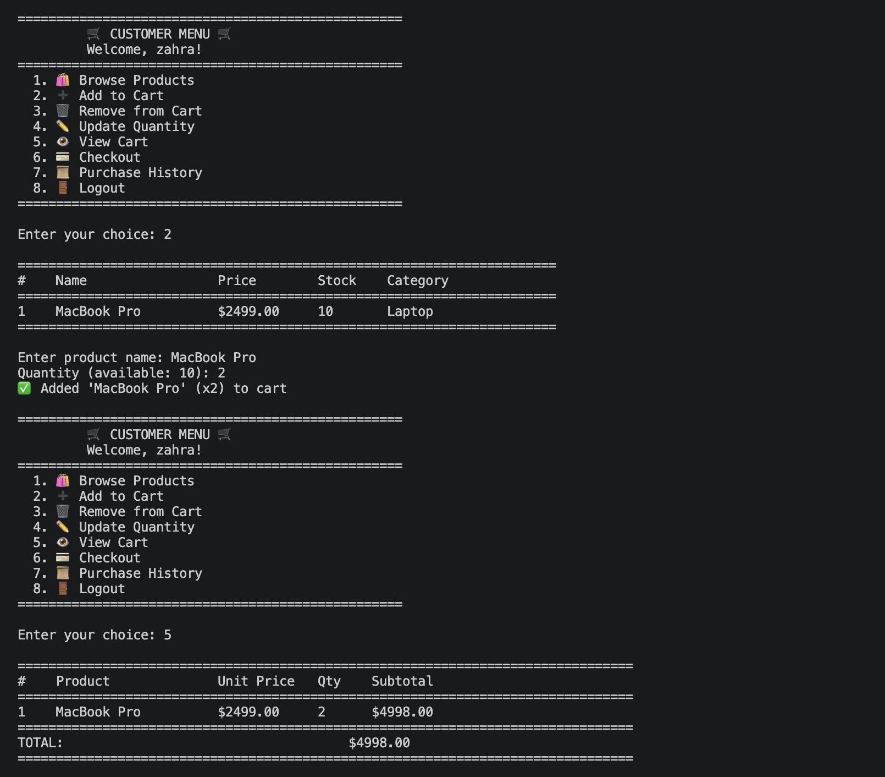
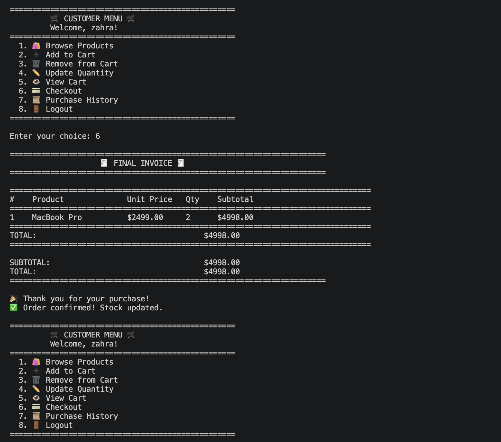
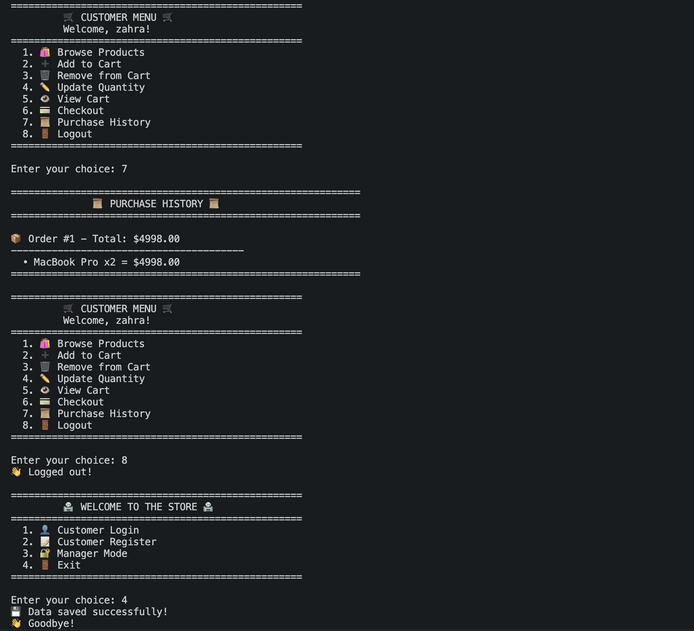

# 🛒 Mini Store System

A console-based Store Management System developed in Python. The application provides separate customer and manager modes, allowing product management, shopping cart operations, and purchase processing.

---

## ✨ Features

### 👨‍💼 Manager

- Add new products
- View all products
- Update product stock
- Browse products by category
- Save product data

### 🛍️ Customer

- Register and login
- Browse available products
- Add products to cart
- Remove products from cart
- Update cart quantities
- Checkout and generate invoice
- View purchase history

---

## 🛠️ Technologies

- Python 3
- Object-Oriented Programming (OOP)
- File Handling
- Git
- GitHub

---

## 🚀 How to Run

```bash
python ministore.py
```

---

## 📂 Project Structure

```
mini-store-system/
│
├── ministore.py
├── README.md
└── screenshots/
```

---

# 📸 Screenshots

## Main Menu



---

## Manager Menu



---

## Customer Menu



---

## Shopping Cart





---

## Sample Output

```text
=========================================
      🏪 WELCOME TO THE STORE 🏪
=========================================

1. Customer Login
2. Customer Register
3. Manager Mode
4. Exit
```

---

## 📌 Project Highlights

- Inventory Management
- Customer Authentication
- Shopping Cart
- Stock Control
- Purchase History
- Console User Interface

---

## 👨‍💻 Author

**Zahra Solhjoo**

GitHub: https://github.com/zahra-solhjoo

⭐ If you like this project, consider giving it a star.
